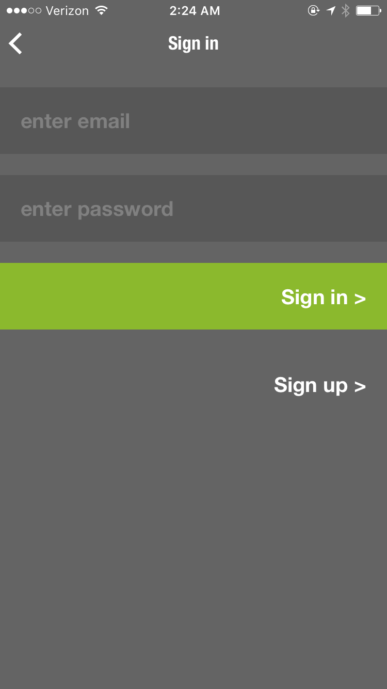

# Introduction
A simple microblog app for Jasonette.

---

# Features
Includes both backend / frontend code.

The backend is just a simple rails app with devise-powered account system.

The frontend code is just two JSON files:

- [Display posts](app/views/posts/index.json.jbuilder)
- [Login screen](public/login.json)

These two JSON files turn into a native iOS app, powered by [Jasonette](http://www.jasonette.com/beta)

Signed out | Signed in
-----------|--------------------
 | 

---

# Demo
1. Get [Jasonette](http://www.jasonette.com/beta)
2. Set the URL to [http://sessionjason.herokuapp.com/posts.json](http://sessionjason.herokuapp.com/posts.json)

If you don't know how to use Jasonette, [check out the tutorial](https://jasonette.github.io/documentation)

---

# How this was built
## Backend
The backend is built with ruby on rails.

Follow the steps below to recreate this project on your own:

###1. Create a project

    $ rails new jasonserver

###2. Generate scaffold
It's going to be just a simple app with a post, and each post belongs_to a user.

    $ rails generate scaffold Post content:text user_id:integer

###3. Implement Devise and token authentication
We will use [devise](https://github.com/plataformatec/devise) for authentication.

Also, we will use [simple_token_authentication gem](https://github.com/gonzalo-bulnes/simple_token_authentication) for implementing token authentication on top of devise.

    # in Gemfile
    gem 'devise'
    gem 'simple_token_authentication', '~> 1.0'

Then we run the usual devise install commands, creating a `User` model and letting devise take over.

    $ rails generate devise:install

    $ rails generate devise User

Then we add an `authentication_token` field to `User`.

    $ rails g migration add_authentication_token_to_users "authentication_token:string{30}:uniq"

To integrate the [simple_token_authentication gem](https://github.com/gonzalo-bulnes/simple_token_authentication), we add the line **acts_as_token_authenticatable**, like below:

    # in User.rb
    class User < ActiveRecord::Base
      acts_as_token_authenticatable
      devise :database_authenticatable, :registerable,
            :recoverable, :rememberable, :trackable, :validatable
    end

Notice we've removed `:confirmable` devise attribute from the second line, which devise generated for us, since we won't use email confirmation for sign up.

Lastly, migrate.

    $ rake db:migrate

###4. Add authentication to controllers

Add the `:authenticate_user!` line to `posts_controller.rb` so that it authenticates before calling any actions.
    
    # in posts_controller.rb
    class PostsController < ApplicationController
    
      before_action :authenticate_user!
      ...
    
    end

Also make `application_controller.rb` token authenticatable:

    # in application_controller.rb
    class ApplicationController < ActionController::Base
      acts_as_token_authentication_handler_for User
      respond_to :html, :json
      protect_from_forgery with: :null_session
    end

###5. Set up associations

Add `has_many :posts` to `User` model, and `belongs_to :user` to `Post` model.

    # in User.rb
    class User < ActiveRecord::Base
      has_many :posts
      acts_as_token_authenticatable
      devise :database_authenticatable, :registerable,
            :recoverable, :rememberable, :trackable, :validatable
    end

    # in Post.rb
    class Post < ActiveRecord::Base
      belongs_to :user
    end

Also don't forget to update `new` and `create` actions so they tie each post with user accounts.

    # in posts_controller.rb
    class PostsController < ApplicationController
    
      ...
    
      def new
        @post = current_user.posts.build
      end
      
      def create
        @post = current_user.posts.build(post_params)
      end
    
      ...
    
    end

###6. Update route

We want the root route to map to `posts#index`. Update `config/routes.rb`

    # in config/routes.rb
    
      root "posts#index"

###7. Override `authenticate_user!` to handle html and json separately

    class ApplicationController < ActionController::Base
      acts_as_token_authentication_handler_for User
      respond_to :html, :json
      protect_from_forgery with: :null_session
    
      protected
      def authenticate_user!
        if self.request.format.html?
          super
        elsif self.request.format.json?
          if self.request.parameters["controller"].start_with?("devise")
            # use the default if session related
            super
          else
            # others
            if user_signed_in?
              # use the default if already signed in
              super
            else
              # serve the static login page if not signed in
              @data = File.read("#{Rails.root}/public/login.json")
              @data = @data.gsub(/ROOT/, root_url)
              render :json => @data
            end
          end
        end
      end
    end

###8. If deploying to Heroku (optional)

Don't forget to add these to your Gemfile if you're deploying to heroku:

    # in Gemfile
    gem 'sqlite3', group: :development
    gem 'pg', group: :production
    gem 'rails_12factor', group: :production

Now the backend API is ready!

---

## JSON Frontend

Now that our backend is ready, let's write the JSON that will power our iOS app.

If you look at the `authenticate_user!` logic above, it renders a json content located at [public/login.json](public/login.json) if a user is not signed in.

That's the JSON markup for a login page. The sign in button part looks like this:

    ...
    "text": "Sign in >",
    "action": {
      "type": "$network.request",
      "options": {
        "url": "ROOT/users/sign_in.json",
        "method": "post",
        "data": {
          "user[email]": "{{$get.email}}",
          "user[password]": "{{$get.password}}"
        }
      },
      "success": {
        "type": "$session.set",
        "options": {
          "domain": "ROOT",
          "header": {
            "X-User-Email": "{{$jason.email}}",
            "X-User-Token": "{{$jason.authentication_token}}"
          }
        },
        "success": {
          "type": "$href",
          "options": {
            "url": "ROOT/posts.json",
            "transition": "replace"
          }
        }
      },
      "error": {
        "type": "$util.banner",
        "options": {
          "title": "Error",
          "description": "Something went wrong. Please check if you entered your email and password correctly"
        }
      }
    }
    ...

If you scroll up to the `authenticate_user!` code, you'll see that it replaces `ROOT` with `root_url`, before returning the response:

    @data = @data.gsub(/ROOT/, root_url)

So here's what will happen when a user taps **Sign in**.

###1. It first makes a `$network.request` to the sign in url, to which the server returns a response that looks something like this:

    {
      "id":2,
      "email":"ethan@ethan.fm",
      "created_at":"2016-10-14T22:55:00.664Z",
      "updated_at":"2016-10-15T05:22:41.730Z",
      "authentication_token":"fnekz4hf7ghw95m6ks0rf01j"
    }

###2. Then it goes on to the next action which is `$session.set`. This stores the session using the response from the preceding $network.request action. 

###3. Then it reloads ROOT/posts.json. This time the session is set and is automatically attached to the request, therefore successfully loading the posts JSON.
